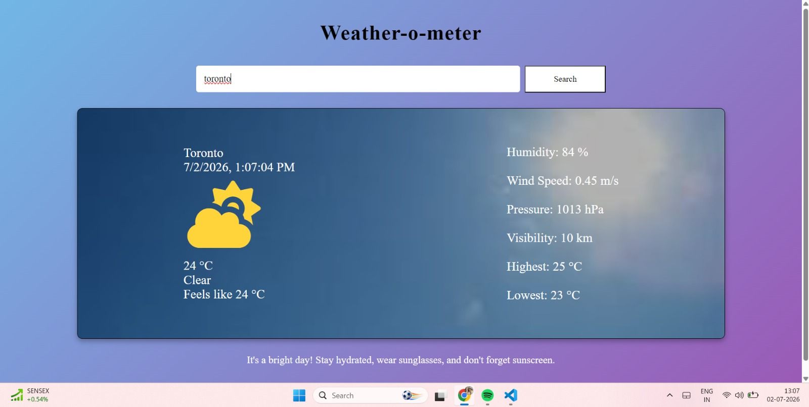
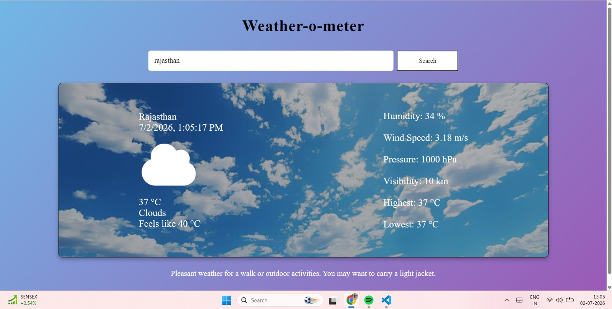

# 🌦️ Weather-o-meter

A simple weather application built with **HTML, CSS, and JavaScript** that lets users check real-time weather conditions for any city. The app fetches live weather data using the OpenWeather API and updates the interface dynamically based on the current weather and time of day.

## Features

* Search weather by city name
* Real-time weather data using the OpenWeather API
* Current temperature and feels-like temperature
* Humidity, wind speed, pressure, and visibility
* Maximum and minimum temperature
* Dynamic weather icons using Font Awesome
* Weather-specific background images
* Different backgrounds for day and night
* Weather-based suggestions for users
* Responsive and clean user interface

## Built With

* HTML5
* CSS3
* JavaScript (ES6)
* OpenWeather API
* Font Awesome

## Getting Started

1. Clone this repository.

2. Open the project folder.

3. Replace the API key in `index.js` with your own OpenWeather API key.

```javascript
const apiKey = "YOUR_API_KEY";
```

4. Open `index.html` using Live Server (recommended) or any local web server.

## API

This project uses the OpenWeather API to fetch live weather information.

You can generate a free API key here:

https://openweathermap.org/api

## What I Learned

This project helped me gain hands-on experience with:

* DOM manipulation
* Event handling
* Fetch API
* Async/Await
* Working with JSON data
* API integration
* Updating the UI dynamically based on data
* Writing cleaner and more modular JavaScript

## Future Improvements

Some features I'd like to add in the future:

* Current location weather
* 5-day weather forecast
* Temperature unit toggle (°C / °F)
* Better animations and transitions
* Backend integration to securely manage the API key


## Preview




## Author

**Jhanvi Gupta**

If you have any suggestions or feedback, feel free to connect or open an issue.

---

Thank you for checking out Weather-o-meter! ⭐
